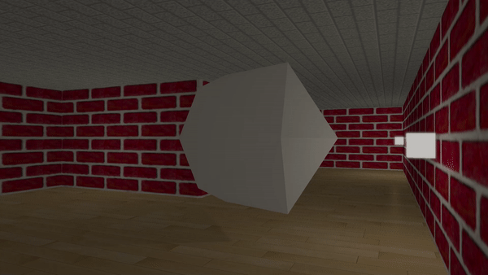

 

<h3>3D Maze Game</h3>

<h6 padding="-30px">Kaier's very first game made by C++ and OpenGL</h6>

Game play Demo https://youtu.be/28xk5s_zk2w

## Introduction

"3D Maze" is a 3D FPS game that allows players to discover unique large scale mazes in a horror atmosphere. The scene in game is referencing to the Windows 95 3D Maze screen saver. The game was created as a self-study project for learning C++ and OpenGL.

Library GLEW, GLFW and stb-image are used in this project. All the textures used were downloaded from internet.

## Installation

1. Download the last version:
   - [Version 1.0](https://drive.google.com/uc?export=download&id=1a9GvrxTeiOnKzkMFf9_kUNPvA1CtX7y4)
2. Unzip the file
3. run 3D_MAZE.exe

## Gameplay

#### Movement

Use W,A,S,D to control the position, use mouse to control the view.

#### FlashLights

You can turn on/off the flashllights by press "L".

#### God Mode

This game allows you to ignore the obstacle and fly freely in the space by turning God Mode on. Press "G" to toggle the God Mode. Notice: you will be teleport to the nearest eligible location in maze after you turn off the God Mode

#### Icosahedron

You may counter several icosahedron in the maze. Everytime you touch an icosahedron, the world will flip upside down, and the icosahedron will disappear. This effect will not be triggered in God Mode.

#### Timer

Timer will start once the game is launched, and the console will display the time you spend after you reached to the end point.

## Highlights

- **Unique map each game**

  [Recursive backtracking](http://weblog.jamisbuck.org/2010/12/27/maze-generation-recursive-backtracking) is used to generate perfect maze in this game to ensure the map is different in every game. The map and end point will be displayed on console.

  

- **Dynamic lights & shadows casting**

  This game uses forward multi-pass rendering to render lights and shadows. Each light needs a texture mapping unit (TMU) to smaple the shadows. Since GPU only has limited number of TMU, only specific number of lights that are close to the players will cast light and shadows.

